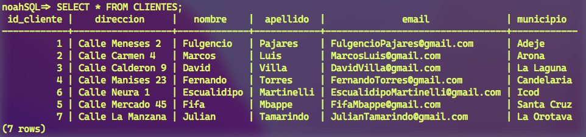
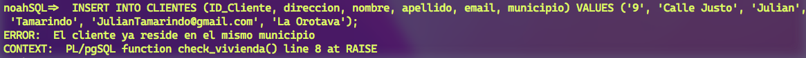
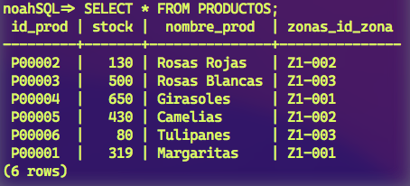

# Practica 6: Disparadores

En esta practica vamos a crear una serie de disparadores o triggers para mejorar nuesta base de datos.

## Trigger 1: Creacion de Email de cliente

Antes de empezar con este trigger, era importante añadir este atributo a la tabla. Ademas decidimos añadir tambien los atributos Nombre y Apellido, para poder asi, crear el email del cliente que se creaba por defecto.

Para añadir los atributos utilizamos estos comando:

```sql
ALTER TABLE CLIENTES ADD NOMBRE VARCHAR(15);
ALTER TABLE CLIENTES ADD APELLIDO VARCHAR(15);
ALTER TABLE CLIENTES ADD EMAIL VARCHAR(50);
ALTER TABLE CLIENTES ADD MUNICIPIO VARCHAR(15);
```

Una vez añadida las columnas empezamos a crear los triggers:

El primer trigger hace lo siguiente, antes de insertar un nuevo cliente en la base de datos, esta, tienen que comprobar si se ha añadido un email al mismo. En caso de que se añada un email, este va a la base de datos directamente. En caso contrario, si el dato es NULL, el trigger tiene que actuar, creando uno por defecto, el cual estara hecho con el nombre concatenado con el apellido del cliente, junto con el dominio @gmail.com.

```sql
CREATE OR REPLACE FUNCTION crear_email() RETURNS TRIGGER AS $example_table$
   BEGIN
    IF NEW.email IS NULL THEN
      NEW.email := CONCAT(NEW.Nombre, NEW.Apellido, '@', TG_ARGV[0]);
    ELSIF (NEW.email not like '%@gmail.com') THEN
      RAISE EXCEPTION 'El correo no es valido';
    END IF;
   RETURN NEW;
   END
$example_table$ LANGUAGE plpgsql;

CREATE TRIGGER email_trigger BEFORE INSERT ON CLIENTES
FOR EACH ROW EXECUTE PROCEDURE crear_email('gmail.com');
```



Vemos que al introducir el cliente con ID 7 con su email como NULL, se crea automaticamente por defecto

## Trigger 2: Solo una vivienda

Para crear este trigger es importante haber añadido la columna Municipio, para poder comprobar que un cliente no viva en viviendas diferentes en un mismo municipio.

```sql
CREATE OR REPLACE FUNCTION check_vivienda() RETURNS TRIGGER AS $example_table$
          BEGIN
                      IF EXISTS (SELECT * FROM CLIENTES
                                         WHERE Nombre = NEW.Nombre
                                          AND Apellido = NEW.Apellido 
                                          AND Municipio = NEW.Municipio
                                          AND Direccion != NEW.Direccion) THEN                                            
                          RAISE EXCEPTION 'El cliente ya reside en el mismo municipio';
                     END IF;
         RETURN NEW;
         END
$example_table$ LANGUAGE plpgsql;
```

```sql
CREATE TRIGGER checkVivienda BEFORE INSERT ON CLIENTES
FOR EACH ROW EXECUTE PROCEDURE check_vivienda();
```



En el ejemplo vemos que si queremos introducir un cliente que ya reside en ese municipio, nos salta el mensaje de error, como que ya vive en el mismo municipio.

## Trigger 3: Stock actualizado

Por ultimo, este trigger lo que hace es actualizar la tabla Productos, concretamente el stock del producto en el cual se produce una venta.
Un error que nos surgio fue a la hora de la comparacion de las variables, ya que Cantidad estaba en VARCHAR, mientras que Stock en INT, solo tuvimos que modifiar el tipo de cantidad a INT.

```sql
CREATE OR REPLACE FUNCTION updateStock() RETURNS TRIGGER AS $updateStock$
  BEGIN
    IF EXISTS (SELECT * FROM Productos WHERE ((Productos.ID_Prod = NEW.PRODUCTOS_ID_Prod) AND (Productos.Stock >= NEW.Cantidad))) THEN
      UPDATE Productos SET Stock = (Productos.Stock - NEW.Cantidad) WHERE ((Productos.ID_Prod = NEW.PRODUCTOS_ID_Prod) AND (Productos.Stock >= NEW.Cantidad));
    END IF;
    RETURN NEW;
  END;
$updateStock$ LANGUAGE plpgsql;
```

```sql
CREATE TRIGGER nuevoStock BEFORE INSERT ON VENTAS
FOR EACH ROW EXECUTE PROCEDURE updateStock();
```



Al introducir en la tabla ventas una nueva fila, en este caso:

```sql
INSERT INTO VENTAS (EMPLEADOS_ID_Empleado, CLIENTES_ID_Cliente, PRODUCTOS_ID_Prod, Fecha, Cantidad) VALUES ('9', '1', 'P00001', '10-11-2021', 1);
```

Se ha actualizado el stock del producto de la tabla Productos. Ha pasado de 320 a 319.

Tambien nos surgio otro problema, ya que teniamos en la tabla ZONAS un atributo Stock_Prod, que hacia redundancia, por lo que decidimos suprimirlo:

```sql
ALTER TABLE ZONAS DROP COLUMN Stock_Prod;
```