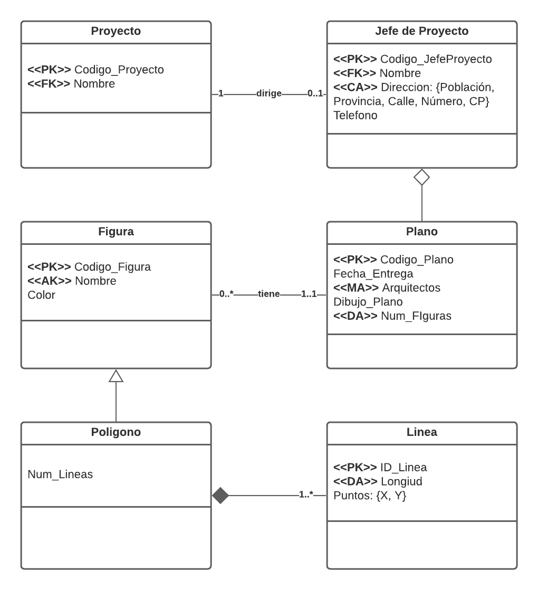

# Informe Practica 7
## Introduccion

En esta practica vamos a crear el diagrama UML del proyecto de Arquitectos. Asi como el scrip SQL para crear las tablas

## Participantes

* Adrian Hernandez Suarez
* Noah Sanchez Geurts
* Alberto Ravelo Cordobes

## Diagrama UML



## Script SQL

* Crear Tipo Dirección

```sql
CREATE TYPE TipoDireccion AS
(
  Tipo_Via VARCHAR(4),
  Nombre_Via VARCHAR(100),
  Poblacion VARCHAR(50),
  CP VARCHAR(5),
  Provincia VARCHAR(50)
);
```

* Crear Tipo Jefe de Proyecto

```sql
CREATE TYPE JefeProyecto AS
(
  CodJefeProyecto INTEGER,
  Nombre VARCHAR(100),
  Direccion TipoDireccion,
  Telefono VARCHAR(10),
  Dirige REF(Proyecto)
);
```

* Crear tabla Jefes

```sql
CREATE TABLE Jefes_Proyecto OF JefeProyecto
(
  PRIMARY KEY CodJefeProyecto,
  UNIQUE Nombre
);
```

* Crear tipo Proyecto

```sql
CREATE TYPE Proyecto AS
(
  Cod_Proyecto INTEGER,
  Nombre VARCHAR(20),
  Dirigido REF(JefeProyecto),
  Tiene REF(Plano)
);
```

* Crear tabla Proyectos

```sql
CREATE TABLE Proyectos OF Proyecto
(
  PRIMARY KEY Cod_Proyecto,
  NOT NULL Dirigido
);
```

* Crear tipo Plano

```sql
CREATE TYPE Plano AS
(
  Cod_Plano INTEGER,
  Fecha_Entrega DATE,
  Arquitectos VARCHAR(10)ARRAY[10],
  DibujoPlano BITMAP,
  Num_Figuras INTEGER,
  Tiene_Fig REF(Figura)
);
```

* Crear tabla Planos

```sql
CREATE TABLE Planos OF Plano 
(
  PRIMARY KEY Cod_Plano
);
```

* Crear tabla Figura

```sql
CREATE TYPE Figura AS 
(
  Cod_Figura Integer,
  Nombre VARCHAR(30),
  Color VARCHAR(30),
  Plano_Pert REF(Plano)
  TRIGGER ActualizarNumFiguras RETURNS Integer
);
```

* Crear método ActualizarNumFiguras

```sql
CREATE TRIGGER ActualizarNumFiguras FOR Figura
AFTER INSERT OR DELETE ON Figuras
  BEGIN
    IF INSERT THEN
      UPDATE TABLE Plano WHERE Figuras.Nombre = Plano.Tiene_Fig SET Plano.Num_Figuras = Plano.Num_Figuras + 1;
    ELSE
      UPDATE TABLE Plano WHERE Figuras.Nombre = Plano.Tiene_Fig SET Plano.Num_Figuras = Plano.Num_Figuras - 1;
  END;
```

* Crear tabla Figuras

```sql
CREATE TABLE Figuras OF Figura
(
  PRIMARY KEY Cod_Figura,
  NOT NULL Plano_Pert
);
```

* Crear tipo Poligon

```sql
CREATE TYPE Poligono UNDER Figura AS
(
  Num_lineas Integer,
  Tiene_lineas REF Linea MULTISET
);
```

* Crear tabla Poligonos

```sql
CREATE TABLE Poligonos OF Poligono UNDER Figuras;
```

* Crear Tipo Punto 

```sql
CREATE TYPE Punto AS
(
  PuntoX INTEGER,
  PuntoY INTEGER
);
```

* Crear Tipo Linea

```sql
CREATE TYPE Linea AS
(
  ID_Linea INTEGER,
  Puntos Punto ARRAY(2),
  METHOD Longitud RETURNS Number
);
```

* Crear Metodo Longitud

```sql
CREATE METHOD Longitud for Linea
BEGIN
RETURN SELF.Punto[0] - SELF.Punto[1]
END;
```

* Crear tabla Lineas

```sql
CREATE TABLE Lineas OF Linea
(
  ID_Linea PRIMARY KEY
);
```
